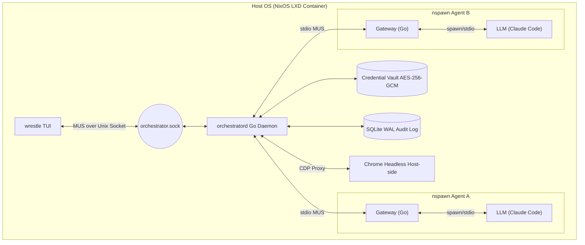
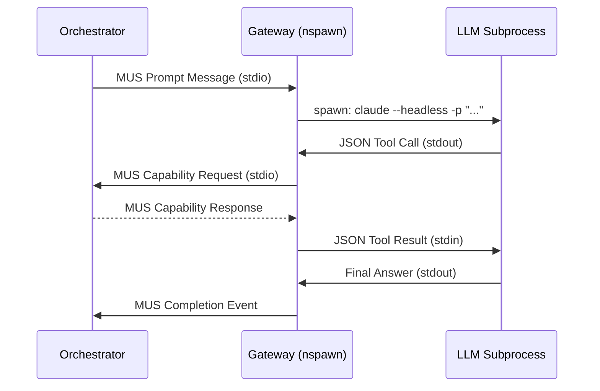

# WRESTLE System Design

## Architecture Overview

WRESTLE employs a **Star Topology** around a central, Go-based Orchestrator. The Orchestrator acts as the hypervisor, message router, and security firewall for a swarm of isolated AI agents.



---

### 1. Isolation and Persistence (The "Linux Engine")

- **Containerization:** Each agent runs inside a dedicated `systemd-nspawn` container with User Namespacing (`-U`), isolating process tree, IPC, and hostname.
- **Filesystem:** Each agent has a dedicated Btrfs subvolume. The Gateway binary and core config are bind-mounted read-only from the host. The agent's working directory, inbox, outbox, and telemetry are writable within the subvolume.
- **Inbox/Outbox Pattern:** Prompt inputs, responses, and telemetry events are written to well-known paths within the subvolume, making agent state auditable by simply inspecting the filesystem.
- **Btrfs Snapshots:** A snapshot of the agent subvolume is taken before any self-directed "evolution" (config or skill changes), enabling sub-millisecond atomic rollback.
- **Resource Limits:** The Orchestrator configures per-agent cgroup v2 limits (CPU shares, memory max, IO weight) at nspawn spawn time, enforcing resource isolation within the swarm.

---

### 2. The Gateway Binary (Per-Agent Control Plane)

The **Gateway** is a purpose-built Go binary deployed into each nspawn container. It is the agent's sole interface to the outside world — both to the Orchestrator and to the LLM.

**Responsibilities:**

- Maintains a persistent stdio connection to the Orchestrator (the MUS pipe).
- Spawns the LLM CLI (e.g., Claude Code, or a pluggable alternative) as a subprocess when a new prompt message arrives on stdin.
- Translates LLM subprocess output (JSON tool calls) into MUS capability requests, sends them upstream to the Orchestrator, and returns the MUS response to the LLM subprocess as tool call results.
- Enforces prompt completion boundaries: when the LLM subprocess exits, the Gateway emits a **Completion Event** log record.
- Detects and reports agent failure modes (see Section 6: Logging).

**LLM invocation model:**



**Pluggability:** The Gateway uses a thin `AgentCLI` interface so that `claude`, `gemini`, or any future CLI-driven LLM can be substituted without changing the Gateway binary.

---

### 3. The Control Plane (TUI ↔ Orchestrator)

The **`wrestle` TUI** is a separate binary from the Orchestrator daemon (`orchestratord`). They communicate over a **Unix domain socket** at a well-known path inside the NixOS container (e.g., `<workspace_root>/orchestrator.sock`).

The socket uses the same MUS frame format as the agent stdio pipes — a `SwarmHeader` followed by a typed payload. The TUI identifies itself as `FromID: "ctl"`, a reserved identity that the Orchestrator's ACL layer treats as operator-level, granting access to control messages that agents cannot send.

**Control message types (ctl-only):**

| MsgType | Direction | Purpose |
|---|---|---|
| `MsgType_CtlSubscribe` | TUI → Orchestrator | Subscribe to live Completion and Failure event push stream. |
| `MsgType_CtlEvent` | Orchestrator → TUI | Pushed on each Completion or Failure event; carries the structured log payload. |
| `MsgType_CtlAgentCreate` | TUI → Orchestrator | Provision a new agent workspace from a template. |
| `MsgType_CtlAgentStop` | TUI → Orchestrator | Terminate a running agent nspawn container. |
| `MsgType_CtlVaultAdd` | TUI → Orchestrator | Add or rotate a credential in the vault. |
| `MsgType_CtlStatus` | TUI → Orchestrator | Request a full snapshot of current agent states (used on TUI startup). |

The TUI connects to the socket at startup, sends `MsgType_CtlSubscribe`, then receives an initial `MsgType_CtlStatus` response followed by a live stream of `MsgType_CtlEvent` pushes as agents run. The BubbleTea matrix view is driven entirely by these events — no polling.

Any `wrestle` CLI subcommand (e.g., `wrestle agent create`, `wrestle vault add`) sends the corresponding ctl MUS message to the socket and waits for an acknowledgement, so the daemon is the single source of state even from non-interactive invocations.

---

### 4. The Swarm Switchboard (Agent Messaging)

- **Transport:** Pure stdio (`stdin`/`stdout`) pipes between the Orchestrator process and each Gateway binary. No network sockets or message brokers are required.
- **Serialization:** All messages use the MUS (Marshal, Unmarshal, Size) binary format for O(1) performance and zero-allocation routing.
- **Frame Format:** Every message is a length-prefixed MUS frame containing a `SwarmHeader` followed by a payload:

```go
type SwarmHeader struct {
    Version uint8
    FromID  string
    ToID    string   // "agent-id", "group:name", or "*" for broadcast
    MsgType uint8    // see MsgType constants
    SeqNo   uint64   // monotonic, per-sender; used for loop detection
}
```

- **Routing:** The Orchestrator reads the `SwarmHeader` from each agent's pipe and routes to unicast, multicast (group prefix), or broadcast destinations. The `SeqNo` field is validated to be strictly increasing per sender — a non-monotonic sequence triggers a security log event.
- **Identity integrity:** The Orchestrator stamps the `FromID` on all inbound frames itself, derived from which pipe the bytes arrived on. Agent-supplied `FromID` values in the header are ignored and overwritten. This prevents identity spoofing.
- **Chain tracking:** Two additional fields are carried in the header to enforce invocation depth limits:

```go
type SwarmHeader struct {
    Version  uint8
    FromID   string
    ToID     string   // "agent-id", "group:name", or "*" for broadcast
    MsgType  uint8
    SeqNo    uint64   // monotonic per-sender; used for loop detection
    ParentID string   // ID of the agent that invoked this one; "" for top-level
    Depth    uint8    // invocation chain depth; Orchestrator increments on each hop
}
```

---

### 5. Agent Topology & Relationships

The Orchestrator enforces a directed, acyclic **invocation graph** across the swarm. An agent may only send task messages to agents it is explicitly permitted to invoke. This prevents unconstrained fan-out, runaway recursive spawning, and agents communicating outside their intended scope.

#### 5a. Topology Declaration

The swarm topology is declared in `orchestrator.kdl`. Each `agent` block defines which other agents it may invoke, how many concurrently, and whether it may spawn new agent instances from templates.

```kdl
// orchestrator.kdl
swarm {
    max-agents   20   // hard cap on total live agents at any time
    max-depth     4   // max invocation chain depth before the Orchestrator refuses routing

    agent "coordinator" {
        can-invoke      "researcher" "writer" "coder"
        max-concurrent  5     // max subagents active at the same time
        max-spawns      20    // max total new agent instances this agent may spawn per run
        can-spawn       true  // allowed to request new nspawn instances from a template
    }

    agent "researcher" {
        can-invoke      "browser-agent"
        max-concurrent  2
        can-spawn       false
    }

    agent "writer" {
        can-invoke      none
        max-concurrent  0
        can-spawn       false
    }

    agent "coder" {
        can-invoke      none
        max-concurrent  0
        can-spawn       false
    }

    agent "browser-agent" {
        can-invoke      none
        max-concurrent  0
        can-spawn       false
    }
}
```

#### 5b. Enforcement at Routing Time

When the Orchestrator receives a `Swarm_Message_Send` or `Swarm_Agent_Spawn` request, it checks in order:

1. **Relationship permitted:** Is `ToID` in the sender's `can-invoke` list? → else `capability_denied`.
2. **Concurrency limit:** Does the sender currently have fewer than `max-concurrent` active invocations outstanding? → else `capability_denied`.
3. **Depth limit:** Would routing this message exceed `max-depth` (`Depth` field in `SwarmHeader`)? → else `capability_denied`.
4. **Spawn budget:** For spawn requests, has the sender issued fewer than `max-spawns` this run? → else `capability_denied`.
5. **Swarm cap:** Would this push total live agents above `max-agents`? → else `capability_denied`.

On each hop the Orchestrator increments `Depth` and sets `ParentID` before forwarding. These fields are stamped by the Orchestrator and cannot be forged by agents.

#### 5c. Agent Spawning

An agent with `can-spawn true` may request the Orchestrator to create a new agent instance from a named template:

```kdl
// In agent.kdl grant block:
allow "Swarm_Agent_Spawn" {
    entity "Agent" {
        template "researcher-template"  // restrict to specific templates
    }
    rate { max 5  per="run" }
}
```

The Orchestrator provisions a new Btrfs subvolume from the named template, starts the nspawn container, registers the new agent in the switchboard with `ParentID` set to the requesting agent, and returns the new agent's ID. The spawned agent is automatically torn down when the parent's run completes, unless it is explicitly promoted to a persistent agent by the operator via the TUI.

#### 5d. Groups

Agents may be members of named groups, enabling multicast messaging without enumerating individual targets:

```kdl
// orchestrator.kdl
groups {
    group "researchers" {
        members "researcher-01" "researcher-02" "researcher-03"
    }
    group "writers" {
        members "writer-01" "writer-02"
    }
}
```

An agent sending to `group:researchers` must have each member of that group in its `can-invoke` list. The Orchestrator expands the group and validates each recipient individually before routing.

---

### 6. Headless Cognitive Gateway

Agents interact with the outside world exclusively through MUS capability requests validated by the Orchestrator. Agents never hold credentials or open raw network sockets.

#### 4a. Browser (Chrome Sidecar)

A single headless Chrome instance runs on the **host OS** (outside all nspawn containers), bound to `localhost:9222`. The Orchestrator is the sole process that may connect to this port.

- Agents emit MUS-wrapped CDP verbs (e.g., `Chrome_Tab_GetWebContent`).
- The Orchestrator validates the verb against the agent's ACL in `agent.kdl`.
- Validated requests are translated to Chrome DevTools Protocol JSON-RPC and forwarded to port 9222.
- A whitelisting proxy in the Orchestrator enforces the `browser.whitelist` domain allowlist from `agent.kdl` — requests to unlisted domains are dropped before reaching Chrome.
- Each agent is assigned an isolated Chrome profile (`--user-data-dir`) so cookies, sessions, and storage do not bleed between agents.
- Because Chrome runs on the host OS, the nspawn container image requires no display server, window manager, or GPU drivers.

#### 4b. REST APIs (Google Workspace, etc.)

Heavyweight REST APIs are wrapped by separate **Gateway Go binaries** invoked by the Orchestrator. These binaries translate MUS verbs into authenticated API calls.

- The Orchestrator holds all credentials in an AES-256-GCM encrypted vault. Agents reference a `credential_id` only — the secret value never enters the nspawn jail.
- Gateway binaries strip response metadata bloat before returning results, reducing agent context consumption.
- The vendor-neutral capability naming layer (e.g., `Calendar_Event_Create` rather than `Gsuite_Calendar_Insert`) allows the Orchestrator to swap underlying providers based on the agent's assigned `credential_id` without changing agent code.

---

### 7. ECS Resource Model

CRADLE uses an **Entity-Component-System** approach to model the resources that agents can act on. This separates *what resources exist* from *what actions can be performed on them*, and from *under what conditions those actions are permitted*.

- **Components** (`capabilities/components.kdl`): Reusable property schemas — `Addressable`, `Located`, `Owned`, `Timestamped`, `Scheduled`, `Addressed`, `Sized`, `Shared`. Components are the atomic building blocks.
- **Entities** (`capabilities/entities.kdl`): Named resource types composed from components — `File`, `Link`, `EmailMessage`, `CalendarEvent`, `Document`, `Repository`, etc. Each entity declares which scope constraint keys are valid for policy grants.
- **Capabilities** (`capabilities/capabilities.kdl`): Declare which entities they `reads` or `writes`. This allows the Orchestrator to validate that scope constraints in `agent.kdl` are semantically meaningful for the capability being granted.
- **Policy grants** (`agent.kdl`): Express *when* and *on what subset of resources* a capability may execute, using entity component properties as filter predicates.

**Grant syntax in `agent.kdl`:**

```kdl
agent id="assistant-01" {
    credentials { id "google-workspace-njr" }
    resources { memory_max "2G"  cpu_shares 512 }

    allow "Email_Message_Send" {
        entity "EmailMessage" {
            to-domain "example.com" "partner.org"  // Addressed.to must match
        }
        schedule {
            days "mon" "tue" "wed" "thu" "fri"
            hours "09:00"-"17:00"
            timezone "Europe/London"            // stored UTC, displayed in tz
        }
        rate { max 20  per="day" }
        requires-approval false
    }

    allow "Browser_Page_Read" {
        entity "Link" {
            domain-suffix "wikipedia.org" "arxiv.org"
        }
        // no schedule or rate — always permitted on whitelisted domains
    }

    allow "Database_Query_Exec" {
        entity "DatabaseTable" {
            source-id "analytics-db"
        }
        schedule {
            hours "06:00"-"22:00"
            timezone "UTC"
        }
        rate { max 200  per="hour" }
    }

    allow "Filesystem_File_Write" {
        entity "File" {
            path-prefix "output/"
        }
    }
}
```

**Orchestrator enforcement order** for each incoming capability request:

1. Capability is in the agent's `allow` list → else `capability_denied`.
2. Current time is within `schedule` window (UTC+TZ) → else `capability_denied`.
3. Rate counter for this agent+capability within `rate` limit → else `capability_denied`.
4. Entity scope constraints match the request's target resource → else `capability_denied`.
5. If `requires-approval true` → pause and emit approval event (see §8).
6. Dispatch to gateway.

---

### 8. Approval Flow

When a grant includes `requires-approval true`, the Orchestrator suspends the capability request and notifies registered **notification targets** before proceeding.

**Notification target interface (Go):**

```go
type ApprovalTarget interface {
    Notify(ctx context.Context, req ApprovalRequest) error
    // ApprovalRequest carries: agent_id, capability, entity, arguments, timeout_at
}
```

**Initial target: TUI via ctl socket**

The Orchestrator emits `MsgType_CtlApprovalRequired` to all active ctl subscribers (the TUI). The BubbleTea UI presents the request inline with full detail. The operator responds with `MsgType_CtlApprovalGrant` or `MsgType_CtlApprovalDeny`.

**Future target: mobile push**

A configurable webhook target in `orchestrator.kdl` sends a signed push notification payload to a mobile app endpoint. The mobile app calls back via a short-lived HTTPS endpoint exposed by the Orchestrator. This is the same `ApprovalTarget` interface — the Orchestrator does not need to know which targets are registered.

```kdl
// orchestrator.kdl
approval {
    timeout "5m"         // auto-deny if no response within this window
    on-timeout "deny"    // deny | approve
    targets {
        target "ctl"     // always registered; the TUI ctl socket
        // target "webhook" url="https://notify.example.com/cradle" secret-id="push-key-01"
    }
}
```

**Control messages added to §3:**

| MsgType | Direction | Purpose |
|---|---|---|
| `MsgType_CtlApprovalRequired` | Orchestrator → TUI | Pushed when a capability is awaiting approval; includes full request detail. |
| `MsgType_CtlApprovalGrant` | TUI → Orchestrator | Operator approves the pending request. |
| `MsgType_CtlApprovalDeny` | TUI → Orchestrator | Operator denies the pending request. |

---

### 9. The Capability Model & SDK

Capabilities use a strict **Namespace_Noun_Verb** grammar (e.g., `Browser_Page_Read`, `Calendar_Event_Create`).

**Permitted verb stems:** `Create`, `Delete`, `Read`, `List`, `Update`, `Stream`, `Exec`, `Invoke`. Vague or vendor-specific verbs are rejected by the linter.

Each capability declares which entity types it operates on:

```kdl
capability "Email_Message_Send" {
    category "Email"
    reads  entity="EmailDraft"
    writes entity="EmailMessage"
    ...
}
```

This lets the Orchestrator validate at load time that every `entity` block in an `allow` grant references an entity type that the capability actually touches.

**Go SDK (`SwarmCapability`):**

```go
type SwarmCapability interface {
    Explain() string       // static JSON schema string for LLM tool discovery
    MarshalMUS() ([]byte, error)
    UnmarshalMUS([]byte) error
}
```

**`wrestle-gen` compile-time tool:** Processes Go structs annotated with `jsonschema` tags and generates the static string returned by `Explain()`. This eliminates runtime reflection overhead and ensures the schema the LLM receives is always in sync with what the Orchestrator's binary actually parses.

```go
// file: chrome_tab_getwebcontent.go
//go:generate wrestle-gen -type=Chrome_Tab_GetWebContent

type Chrome_Tab_GetWebContent struct {
    URL     string `json:"url"      jsonschema:"description=Fully-qualified URL to fetch,example=https://en.wikipedia.org/wiki/Go_(programming_language)"`
    Timeout int    `json:"timeout"  jsonschema:"description=Max wait in seconds,default=30,minimum=1,maximum=120"`
}
```

The linter enforces: Namespace_Noun_Verb naming, `jsonschema` tags on all exported fields (description + at least one example or enum), snake_case JSON keys, no vendor-specific terms in generic namespaces.

---

### 10. Logging

Three distinct log streams are produced, each serving a different consumer:

#### 10a. Completion Events (Structured, per-prompt)

Emitted by the Gateway to the Orchestrator at the end of every LLM subprocess run. Written to the SQLite WAL and surfaced in the TUI.

Fields: `agent_id`, `prompt_seq`, `timestamp_start`, `timestamp_end`, `model`, `input_tokens`, `output_tokens`, `cost_usd`, `context_window_used_pct`, `tool_calls_made`, `outcome` (`success` | `failure` | `loop_abort`).

#### 10b. Agent Failure Events (Structured, actionable)

Emitted by the Gateway when it detects a known failure mode. Written to the SQLite WAL with severity tagging.

| Failure Mode | Trigger | Severity |
|---|---|---|
| `schema_mismatch` | LLM tool call JSON does not validate against the MUS capability schema | `warn` |
| `loop_detected` | Same tool call + arguments repeated N times within a single prompt run | `error` |
| `capability_denied` | MUS capability request rejected by Orchestrator ACL | `warn` |
| `subprocess_crash` | LLM CLI subprocess exits non-zero unexpectedly | `error` |
| `timeout` | LLM subprocess exceeds configured wall-clock limit | `error` |

#### 10c. Audit Trail (Binary MUS, append-only SQLite WAL)

Every MUS frame passing through the Orchestrator Switchboard is recorded verbatim. Payloads are stored as binary blobs. A companion CLI tool (`wrestle-log`) decodes and pretty-prints records, since raw MUS is opaque to standard shell tools.

The hybrid log index format for the WAL table is: `timestamp TEXT | msg_type TEXT | from_id TEXT | to_id TEXT | payload BLOB` — the text columns remain grep-able via `sqlite3`; the payload requires `wrestle-log` to decode.

---

### 11. Cross-Platform Deployment Strategy

- **Base Image:** A minimal NixOS instance defined by a Nix Flake (`distrobuild`), pinning all dependencies — Go toolchain, `systemd-nspawn`, btrfs-progs, SQLite, Chrome.
- **Containerization:** Packaged as an LXD/LXC container with `security.nesting=true` and Cgroup v2 delegation to allow `systemd-nspawn` to operate inside it.
- **Security caveat:** Nesting weakens the outer container's isolation boundary by granting access to additional kernel namespace APIs. This is an accepted tradeoff for the LXD-as-transport-layer design; the Orchestrator's own process isolation is not dependent on the LXD boundary.
- **Host OS:**
  - **Linux:** Native LXD (Ubuntu, Fedora, CachyOS, etc.).
  - **Windows 11:** LXD inside WSL2 (supports Cgroup v2 and GPU offloading).
  - **macOS:** LXD via OrbStack or Lima.
- **`distrobuild`:** A script that builds and exports the NixOS LXD image from the Flake. Running `distrobuild` on any supported host produces a byte-identical image, ensuring environment parity across the swarm.
