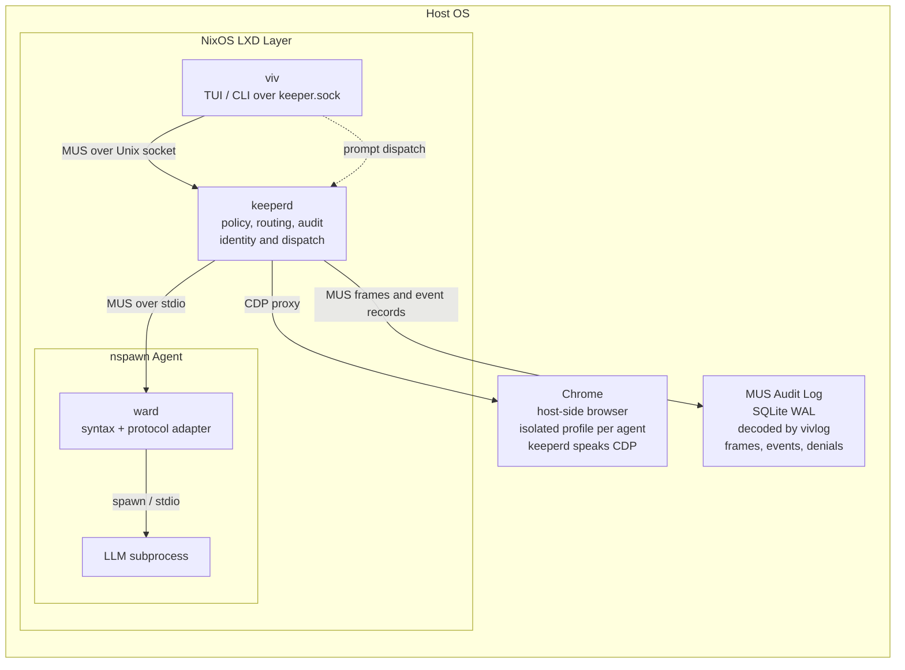
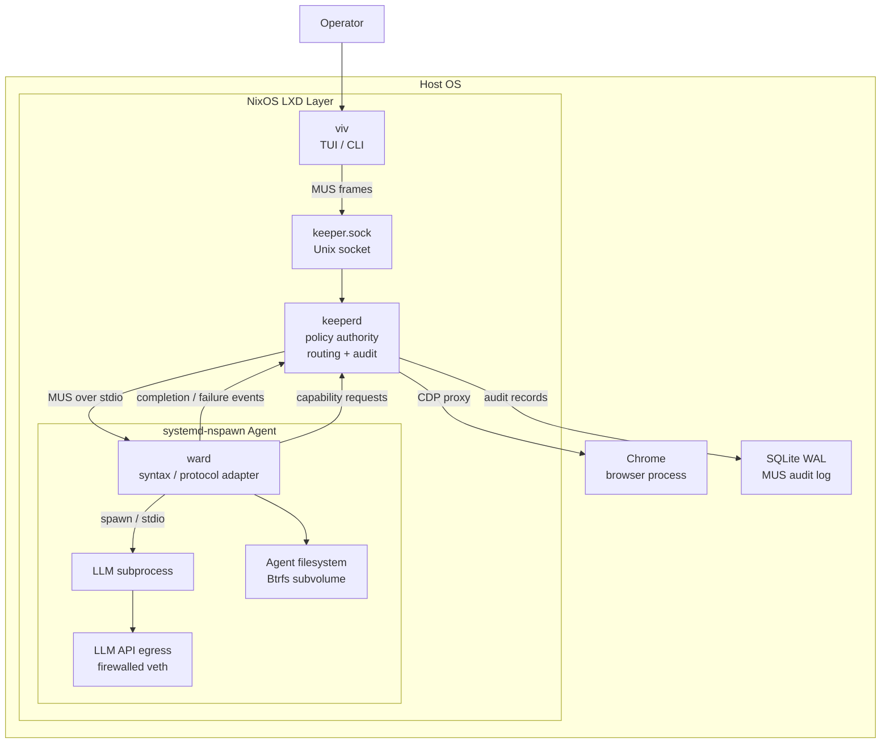

# VIVARY System Architecture

This Mermaid diagram mirrors the architecture diagram currently shown on the website.

## Notes

- Chrome and audit inspection remain outside the container boundary.
- The NixOS LXD layer is the reproducible host environment for `keeperd`, `viv`, and agent provisioning.
- Each agent runs inside `systemd-nspawn` with `ward` as its boundary adapter.
- The agent has no raw credentials and no unrestricted network egress.

## Engineering View

This version is less of a mirror of the landing page and more of a source-of-truth systems view aligned with the current design docs.

## Engineering Notes

- `keeperd` is the semantic and policy authority.
- `ward` is the per-agent syntax/protocol adapter and subprocess manager.
- `viv` talks to `keeperd` over `keeper.sock` using the same MUS frame model as Ward traffic.
- Browser access is host-side and mediated by `keeperd`; the agent never talks to Chrome directly.
- The agent boundary is the combination of the nspawn container, its filesystem, its MUS pipe, and its restricted LLM API egress.
