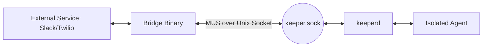

# VIVARY Bridges (External Connectors)

## Overview

Bridges are external processes (e.g., Slack/Telegram bots, webhooks, or legacy system adapters) that connect to `keeperd` to provide **ingress** (triggering prompts) or **egress** (delivering notifications) outside the core runtime.

Unlike Agents, which are isolated and managed by `keeperd`, Bridges are trusted (or at least semi-trusted) host-side processes or external services that speak the MUS protocol over a Unix domain socket.

## Architecture



### Ingress (External -> VIVARY)
Bridges act as the "ears" of the system. They listen for external events and translate them into VIVARY `MsgType_Prompt` messages.
- The Bridge receives a webhook or polling event.
- It identifies the target agent (or uses a default).
- It wraps the payload in a `SwarmHeader` with `FromID: "bridge:id"`.
- `keeperd` receives the prompt and schedules it for execution in the target agent.

### Egress (VIVARY -> External)
Bridges act as the "voice" of the system. They subscribe to event streams from `keeperd` to relay information back to the user.
- The Bridge sends a `MsgType_CtlSubscribe` to `keeperd`.
- `keeperd` pushes `MsgType_CtlEvent` records (completions, failures, or specific output events) to the Bridge.
- The Bridge formats these events for the target platform (e.g., sending a Slack message).

## Capability Exposure

Bridges can also act as **Capability Providers**. While standard capabilities are typically local Go CLI binaries spawned by `keeperd` as REST Gateways, a Bridge can register itself to handle specific MUS capability namespaces.

When an Agent invokes a tool (e.g., `Messaging_SMS_Send`):
1. The **Ward** sends a `MsgType_CapabilityRequest` to `keeperd`.
2. `keeperd` checks its registry. If the capability is routed to a Bridge, it forwards the request to the connected Bridge socket.
3. The Bridge executes the action (e.g., calling the Twilio API) and returns a `MsgType_CapabilityResponse`.

This allows a single Bridge to handle both the ingress (incoming SMS -> prompt) and the egress tool-call (send SMS -> tool result).

## Configuration (`bridge.kdl`)

Bridges must be declared in the global `keeper.kdl` or a dedicated `bridge.kdl` to be granted routing permissions.

```kdl
bridge id="twilio-sms-01" {
    identity "bridge:twilio"
    
    // Ingress permissions
    allow-prompts "assistant-*" "support-agent"
    
    // Egress permissions
    allow-events "agent:*"
    
    // Capability routing
    provides-capability "Messaging_SMS_Send"
    provides-capability "Messaging_SMS_List"
}
```

## Security

- **Socket Access:** Bridges require access to the `keeper.sock`. On Linux, this is restricted by Unix permissions (e.g., only the `vivary` group).
- **Identity Stamping:** `keeperd` stamps the `FromID` based on the authenticated connection. A Bridge cannot spoof its identity.
- **ACLs:** Bridges are only permitted to prompt agents or provide capabilities explicitly granted in their configuration.
