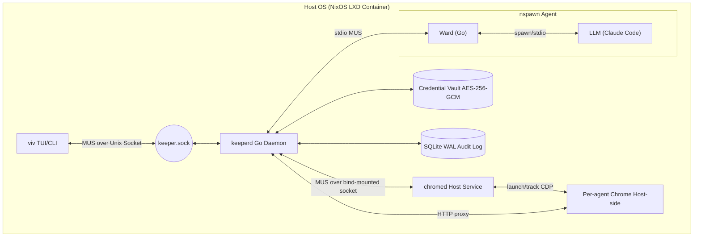
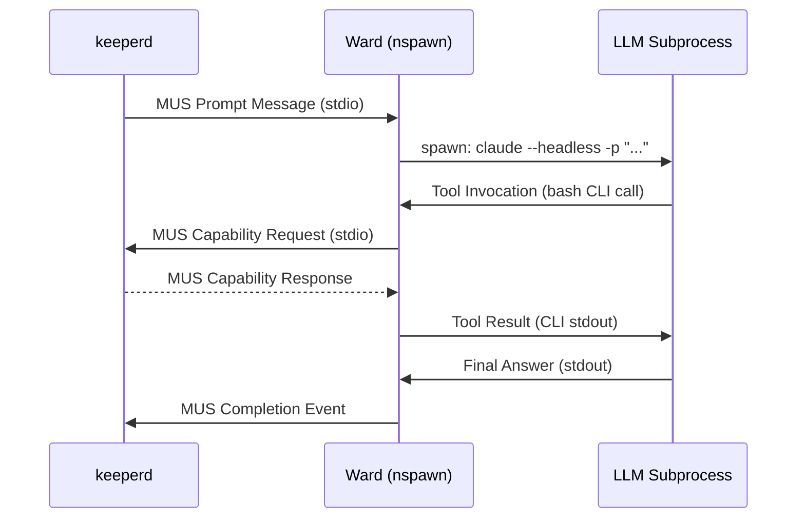

# VIVARY System Design

## Architecture Overview

VIVARY centers on a Go daemon, `keeperd`, that acts as the policy authority, message router, and security firewall for isolated AI agents. The MVP is deliberately single-agent; the swarm topology described later in this document is a follow-on phase built on the same runtime core.



**Scope markers used in this document:**

- **MVP:** single-agent runtime core that proves isolation, capability governance, ctl visibility, and audit/debug tooling.
- **Phase 2:** multi-agent routing, topology controls, and richer fleet UX after the runtime core passes its exit tests.
- **Later:** self-directed runtime evolution and other higher-risk automation.

---

### 1. Isolation and Persistence

- **Containerization:** Each agent runs inside a dedicated `systemd-nspawn` container with User Namespacing (`-U`), isolating process tree, IPC, and hostname.

- **UID Allocation:** Each nspawn container uses a non-overlapping 65,536-entry UID range drawn from `keeperd`'s host-level `/etc/subuid` allocation. `keeperd` assigns and tracks these ranges at agent provision time, ensuring no two agent containers share UIDs within the host namespace.

- **Filesystem:** Each agent has a dedicated Btrfs subvolume. The Ward binary and core config are bind-mounted read-only from the host. The agent's working directory, inbox, outbox, and telemetry are writable within the subvolume.

- **Btrfs Snapshots:** Snapshot support remains part of the runtime foundation, but automated self-directed evolution is not an MVP concern. The first use of snapshots is operator-directed reconfiguration and recovery, with rollback semantics introduced only after the runtime core is proven.

- **Resource Limits:** `keeperd` configures per-agent cgroup v2 limits (CPU shares, memory max, IO weight) at nspawn spawn time.

---

### 2. The Ward (Per-Agent Control Plane)

The **Ward** is a purpose-built Go binary deployed into each nspawn container. It is the agent's sole interface to the outside world.

Conceptually, Ward is a **syntax/protocol adapter**, not a second policy engine. It is responsible for turning whatever tool-call or structured output dialect a supported LLM emits into VIVARY's MUS capability language. `keeperd` remains the semantic authority on whether a request is permitted, scoped correctly, rate-limited, approval-gated, or otherwise executable.

**Agent environmental access is strictly bounded to three channels:**

1. **Its own Btrfs subvolume** — the writable filesystem within its nspawn jail. No access to the host filesystem or other agents' subvolumes.
2. **MUS stdio pipe to `keeperd`** — the sole IPC channel. All capability requests, responses, and telemetry flow through this pipe.
3. **Firewalled LLM API veth** — a dedicated virtual ethernet interface with nftables rules permitting outbound TCP connections only to the configured LLM API endpoint (e.g., `api.anthropic.com:443`). All other outbound traffic is dropped. No other network interfaces exist inside the container.

**Capabilities as CLI tools:**

Capabilities are installed within the nspawn container as self-documenting CLI binaries. The LLM subprocess invokes them as bash tools. Running any capability with `--help` returns its full JSON schema (generated from the `capabilities/*.kdl` source files by `vivgen`). The `capwrap` shim parses CLI flags against generated capability metadata, encodes typed MUS argument payloads, and sends them over the Ward tool socket. Ward validates the typed MUS payload against the generated argument codec, forwards it to `keeperd`, and injects the typed MUS result back through `capwrap` as ordinary tool stdout. `vivgen` now also generates result codecs/metadata for the capability return path so operator-facing rendering can decode MUS results without falling back to JSON transport blobs. The LLM never sees MUS framing — it sees ordinary CLI tools.

**LLM subprocess lifecycle:**

The Ward uses a **per-prompt subprocess model**: a new LLM CLI process (e.g., `claude --headless`) is spawned for each incoming prompt. This ensures clean context boundaries between prompts and eliminates persistent process state management. Claude Code's startup latency (~500ms) is acceptable at prompt granularity. A persistent session mode will be evaluated if profiling shows startup to be a material bottleneck.

**Responsibilities:**

- Maintains a persistent stdio connection to `keeperd` (the MUS pipe).
- Spawns the LLM CLI as a subprocess when a new prompt message arrives.
- Translates LLM tool invocations into MUS capability requests and returns responses.
- Enforces syntactic correctness at the translation boundary: malformed or unparseable tool calls are rejected before they reach `keeperd`.
- Emits execution facts from the local session boundary: subprocess exit status, timeout, malformed-call errors, and completion boundaries.
- Enforces prompt completion boundaries: emits a **Completion Event** log record when the LLM subprocess exits.
- Detects and reports local failure modes at the adapter boundary (see §10).
- On schema-invalid tool arguments, may re-run the prompt a small configured number of times by appending the validation error back into the prompt text; the default is one retry from `agent.kdl` via `schema-error-retries`.

**Responsibility split:**

- **Ward owns:** subprocess lifecycle, backend-specific tool-call parsing, syntactic/schema validation, MUS encoding/decoding at the agent boundary, and local execution reporting.
- **`keeperd` owns:** identity stamping, ACLs, resource scope checks, schedule/rate/approval policy, credential resolution, audit policy, and capability dispatch.

**LLM invocation model:**



**Pluggability:** The Ward uses a thin `AgentCLI` interface so that `claude`, `gemini`, or any future CLI-driven LLM can be substituted without changing the semantic policy core. The adaptation surface should stay narrow: backend-specific parsing belongs in the adapter layer, while policy meaning stays centralized in `keeperd`.

---

### 3. The Control Plane (viv ↔ keeperd)

The **`viv`** TUI and CLI is a separate binary from `keeperd`. They communicate over a **Unix domain socket** at a well-known path inside the NixOS container (e.g., `<workspace_root>/keeper.sock`).

The socket uses the same MUS frame format as the agent stdio pipes — a `SwarmHeader` followed by a typed payload. `viv` identifies itself as `FromID: "ctl"`, a reserved identity the keeper's ACL treats as operator-level, granting access to control messages that agents cannot send.

**Control message types (ctl-only):**

Current MVP implementation status: subscribe/status/prompt/agent lifecycle/ping are implemented. Approval and vault message families remain designed-but-not-yet-implemented and should be treated as deferred until the MVP runtime core is fully consolidated.

| MsgType | Direction | Purpose |
|---|---|---|
| `MsgType_CtlSubscribe` | viv → keeperd | Subscribe to live Completion and Failure event push stream. |
| `MsgType_CompletionEvent` | keeperd → viv | Pushed directly to subscribed ctl clients when a prompt run completes. |
| `MsgType_FailureEvent` | keeperd → viv | Pushed directly to subscribed ctl clients when a prompt run fails. |
| `MsgType_CtlAgentCreate` | viv → keeperd | Provision a new agent workspace from a template. |
| `MsgType_CtlAgentDestroy` | viv → keeperd | Destroy an agent workspace and tear down its runtime state. |
| `MsgType_CtlAgentList` | viv → keeperd | Request the current list of configured or live agents. |
| `MsgType_CtlStatus` | viv → keeperd | Request a full snapshot of current agent states (used on startup). |
| `MsgType_CtlApproval` | reserved | Approval remains designed-but-not-implemented in the current MVP runtime. |

`viv` connects at startup, sends `MsgType_CtlSubscribe`, then explicitly requests `MsgType_CtlStatus`, and finally receives a live stream of raw `MsgType_CompletionEvent` / `MsgType_FailureEvent` pushes. In the MVP this primarily drives a single-agent detail view and CLI status commands; a matrix or fleet view comes with the later multi-agent phase.

Ctl request/response payloads are MUS structs from `internal/ctl/protocol.go` rather than JSON blobs. Any `viv` CLI subcommand (e.g., `viv agent create`) sends the corresponding ctl MUS payload to the socket and waits for acknowledgement. `keeperd` is the single source of state.

---

### 3a. Bridges (External Connectors)

Bridges are external processes (e.g., Slack/Telegram bots, webhooks, or legacy system adapters) that connect to `keeperd` to provide ingress (triggering prompts) or egress (delivering notifications) outside the core runtime.

Bridges are intentionally post-MVP. They remain part of the longer-term platform direction, but they are not required to prove the core single-agent governed runtime.

See [BRIDGES.md](BRIDGES.md) for the full architecture, configuration, and security model.

---

### 4. The Runtime Switchboard (Agent Messaging)

- **Transport:** Pure stdio (`stdin`/`stdout`) pipes between `keeperd` and each Ward binary. No network sockets or message brokers required.
- **Serialization:** All messages use the MUS (Marshal, Unmarshal, Size) binary format for O(1) performance and zero-allocation routing.
- **Frame Format:** Every message is a length-prefixed MUS frame containing a `SwarmHeader` followed by a payload:

```go
type SwarmHeader struct {
    Version    uint8
    Type       MsgType
    FromID     string
    ToID       string
    SeqNo      uint64
    PayloadLen uint32
}
```

`ParentID` and `Depth` remain planned post-MVP multi-agent extensions rather than fields in the current wire header.

- **Routing:** In the MVP, `keeperd` routes request/response traffic between ctl and one Ward pipe. The same framing is designed to extend later to unicast, multicast (group prefix), and broadcast destinations. `SeqNo` is validated to be strictly increasing per sender — a non-monotonic sequence triggers a security log event.
- **Identity integrity:** `keeperd` stamps `FromID` on all inbound frames from the pipe the bytes arrived on. Agent-supplied `FromID` values are ignored and overwritten. Spoofing is structurally impossible.
- **Back-pressure:** Before MUS decoding, each pipe is subject to a configurable byte-rate limit. Frames exceeding the limit are dropped and logged as `pipe_flood` security events. The nspawn cgroup CPU ceiling independently limits the throughput any agent can sustain.
- **Protocol versioning:** The `Version` field in `SwarmHeader` is a wire protocol version, not a per-capability schema version. Breaking capability schema changes require a new capability name (e.g., `Email_Message_Send_v2`). Mixed-version Ward and `keeperd` binaries are not supported in a single swarm — the `distrobuild` image ensures all binaries are compiled from the same Nix Flake revision.

---

### 5. Agent Topology & Relationships (Post-MVP)

After the single-agent runtime core is proven, `keeperd` can enforce a directed, acyclic **invocation graph** across a swarm. An agent may only send task messages to agents it is explicitly permitted to invoke. This prevents unconstrained fan-out, runaway recursive spawning, and agents communicating outside their intended scope.

#### 5a. Topology Declaration

The swarm topology is declared in `keeper.kdl`. Each `agent` block defines which other agents it may invoke, how many concurrently, and whether it may spawn new agent instances from templates.

```kdl
// keeper.kdl
swarm {
    max-agents   20   // hard cap on total live agents at any time
    max-depth     4   // max invocation chain depth before keeperd refuses routing

    agent "coordinator" {
        can-invoke      "researcher" "writer" "coder"
        max-concurrent  5     // max subagents active at the same time
        max-spawns      20    // max total new agent instances this agent may spawn per run
        can-spawn       true  // allowed to request new nspawn instances from a template
    }

    agent "researcher" {
        can-invoke      "browser-agent"
        max-concurrent  2
        can-spawn       false
    }

    agent "writer" {
        can-invoke      none
        max-concurrent  0
        can-spawn       false
    }

    agent "coder" {
        can-invoke      none
        max-concurrent  0
        can-spawn       false
    }

    agent "browser-agent" {
        can-invoke      none
        max-concurrent  0
        can-spawn       false
    }
}
```

#### 5b. Enforcement at Routing Time

When `keeperd` receives a `Swarm_Message_Send` or `Swarm_Agent_Spawn` request, it checks in order:

1. **Relationship permitted:** Is `ToID` in the sender's `can-invoke` list? → else `capability_denied`.
2. **Concurrency limit:** Does the sender currently have fewer than `max-concurrent` active invocations outstanding? → else `capability_denied`.
3. **Depth limit:** Would routing this message exceed `max-depth` (`Depth` field in `SwarmHeader`)? → else `capability_denied`.
4. **Spawn budget:** For spawn requests, has the sender issued fewer than `max-spawns` this run? → else `capability_denied`.
5. **Swarm cap:** Would this push total live agents above `max-agents`? → else `capability_denied`.

On each hop `keeperd` increments `Depth` and sets `ParentID` before forwarding. These fields are stamped by `keeperd` and cannot be forged by agents.

**Identity verification:** A receiving agent can trust that a message with `FromID: "coordinator"` genuinely originated from the coordinator, because `keeperd` overwrites all `FromID` values at ingress from the registered pipe identity. Peer impersonation is structurally prevented. The topology `can-invoke` rules further ensure no agent can route messages to targets it is not permitted to address, validated at step 1.

#### 5c. Agent Spawning

An agent with `can-spawn true` may request `keeperd` to create a new agent instance from a named template:

```kdl
// In agent.kdl grant block:
allow "Swarm_Agent_Spawn" {
    entity "Agent" {
        template "researcher-template"  // restrict to specific templates
    }
    rate { max 5  per="run" }
}
```

`keeperd` provisions a new Btrfs subvolume from the named template, starts the nspawn container, registers the new agent in the switchboard with `ParentID` set to the requesting agent, and returns the new agent's ID. The spawned agent is automatically torn down when the parent's run completes, unless explicitly promoted to a persistent agent by the operator via `viv`.

#### 5d. Groups

Agents may be members of named groups, enabling multicast messaging without enumerating individual targets:

```kdl
// keeper.kdl
groups {
    group "researchers" {
        members "researcher-01" "researcher-02" "researcher-03"
    }
    group "writers" {
        members "writer-01" "writer-02"
    }
}
```

An agent sending to `group:researchers` must have each member of that group in its `can-invoke` list. `keeperd` expands the group and validates each recipient individually before routing.

---

### 6. External Access

Agents interact with the outside world exclusively through MUS capability requests validated by `keeperd`. Agents never hold credentials or open raw network sockets.

#### 6a. Browser (Host `chromed` + Per-Agent Chrome)

A host-side `chromed` service runs on the **host OS** (outside all nspawn containers) and manages per-agent headless Chrome instances with dedicated profile directories. `keeperd` requests sessions from `chromed` over a local MUS socket and receives the per-agent CDP address to use.

- Agents emit MUS-wrapped CDP verbs (e.g., `Browser_Page_Read`).
- `keeperd` validates the verb against the agent's ACL in `agent.kdl`.
- `keeperd` asks `chromed` to `Acquire(agent_id, proxy_server)` the first time an agent needs a browser session.
- `chromed` creates `<profile_root>/<agent_id>` on the host if needed, starts `/usr/bin/google-chrome-beta` with that profile, and returns the CDP address for that agent session.
- Validated requests are translated to Chrome DevTools Protocol JSON-RPC and forwarded to the per-agent CDP endpoint returned by `chromed`.
- The runtime now enforces browser whitelist policy in two places: first in the capability layer during ACL/scope validation, then again in the Chrome proxy before any CDP traffic is sent. This defence-in-depth behavior is part of the MVP runtime and should remain testable at both layers.
- Host Chrome is configured to use a small per-agent HTTP proxy served by `keeperd` inside the LXC guest. The proxy binds on the container network address (not `127.0.0.1`) so the host browser can reach it; the default port range is `8700-8800`, and keeperd selects the next free port when one is already in use.
- The `chromed` MUS socket is exposed into the container by bind-mounting the host runtime directory at `/run/vivary/chromed-host`.
- Current tests cover browser allow/deny behavior at the proxy layer, capability-to-proxy handoff layer, keeperd response/audit layer, and prompt-run boundary. What is still missing is live-Chrome verification against the real sidecar process.
- The current implementation uses one host-managed Chrome process per active agent session, with a dedicated `--user-data-dir` profile per agent managed by `chromed`.
- Because Chrome runs on the host OS, the nspawn container image requires no display server, window manager, or GPU drivers.

**Session lifecycle:**

- `task distro:launch` starts both the LXD runtime container and the matching host `chromed@<container>.service` unit.
- `keeperd` acquires browser sessions lazily on first use, rather than at agent-create time.
- `keeperd` releases the matching `chromed` session when the agent is destroyed.
- `task distro:stop` and `task distro:delete` stop the matching `chromed` unit with the container lifecycle.

**Scaling note:** The current path prefers clearer per-agent profile/process ownership over the lowest possible browser footprint. If this becomes too heavy, a later phase can evaluate explicit browser contexts or pooled browser workers without weakening `keeperd` policy authority.

#### 6b. REST APIs (Google Workspace, etc.)

Heavyweight REST APIs are a post-MVP extension. The intended design is to wrap them with separate **REST Gateway Go binaries** invoked by `keeperd`. Those binaries would translate MUS verbs into authenticated API calls.

- The intended model is that `keeperd` holds credentials and agents reference a `credential_id` only — the secret value never enters the nspawn container. Full vault workflows remain later-phase work.
- Gateway binaries strip response metadata bloat before returning results, reducing agent context consumption.
- The vendor-neutral capability naming layer (e.g., `Calendar_Event_Create` rather than `Gsuite_Calendar_Insert`) allows `keeperd` to swap underlying providers based on the agent's assigned `credential_id` without changing agent code.

#### 6c. LLM API Network Access

Each nspawn container is given a dedicated virtual ethernet pair (`veth`). `keeperd` configures nftables rules on the host-side veth at agent spawn time, whitelisting only the LLM API endpoint:

```text
# Host-side nftables rules applied per-agent veth
table ip vivary-agent-<id> {
    chain forward {
        type filter hook forward priority 0; policy drop;
        ip daddr <resolved-llm-api-ip> tcp dport 443 accept
        # All other traffic: drop
    }
}
```

The LLM API endpoint is specified per-agent in `agent.kdl`:

```kdl
agent id="assistant-01" {
    llm {
        command       "claude" "--headless"
        api-endpoint  "api.anthropic.com:443"   // nftables whitelist target
    }
    ...
}
```

The target hostname is resolved to IP(s) at spawn time and written into the ruleset. The Ward binary itself has no outbound network access — it communicates only via its MUS stdio pipe. Only the LLM subprocess initiates outbound connections, and only to the single whitelisted endpoint.

---

### 7. ECS Resource Model

VIVARY uses an **Entity-Component-System** approach to model the resources that agents can act on. This separates *what resources exist* from *what actions can be performed on them*, and from *under what conditions those actions are permitted*.

- **Components** (`capabilities/components.kdl`): Reusable property schemas — `Addressable`, `Located`, `Owned`, `Timestamped`, `Scheduled`, `Addressed`, `Sized`, `Shared`. Components are the atomic building blocks.
- **Entities** (`capabilities/entities.kdl`): Named resource types composed from components — `File`, `Link`, `EmailMessage`, `CalendarEvent`, `Document`, `Repository`, etc. Each entity declares which scope constraint keys are valid for policy grants.
- **Capabilities** (`capabilities/capabilities.kdl`): Declare which entities they `reads` or `writes`. This allows `keeperd` to validate at load time that scope constraints in `agent.kdl` are semantically meaningful for the capability being granted.
- **Policy grants** (`agent.kdl`): Express *when* and *on what subset of resources* a capability may execute, using entity component properties as filter predicates.

**Grant syntax in `agent.kdl`:**

```kdl
agent id="assistant-01" {
    credentials { id "google-workspace-njr" }
    resources { memory_max "2G"  cpu_shares 512 }

    allow "Email_Message_Send" {
        entity "EmailMessage" {
            to-domain "example.com" "partner.org"  // Addressed.to must match
        }
        schedule {
            days "mon" "tue" "wed" "thu" "fri"
            hours "09:00"-"17:00"
            timezone "Europe/London"            // stored UTC, displayed in tz
        }
        rate { max 20  per="day" }
        requires-approval false
    }

    allow "Browser_Page_Read" {
        entity "Link" {
            domain-suffix "wikipedia.org" "arxiv.org"
        }
        // no schedule or rate — always permitted on whitelisted domains
    }

    allow "Database_Query_Exec" {
        entity "DatabaseTable" {
            source-id "analytics-db"
        }
        schedule {
            hours "06:00"-"22:00"
            timezone "UTC"
        }
        rate { max 200  per="hour" }
    }

    allow "Filesystem_File_Write" {
        entity "File" {
            path-prefix "output/"
        }
    }
}
```

**`keeperd` enforcement order** for each incoming capability request:

1. Capability is in the agent's `allow` list → else `capability_denied`.
2. Current time is within `schedule` window (UTC+TZ) → else `capability_denied`.
3. Rate counter for this agent+capability within `rate` limit → else `capability_denied`.
4. Entity scope constraints match the request's target resource → else `capability_denied`.
5. If `requires-approval true` → pause and emit approval event (see §8).
6. Dispatch to gateway binary.

---

### 8. Approval Flow

Approval is part of the intended policy model, but it is **not implemented in the current MVP runtime**. Until the ctl approval path is built, grants using `requires-approval true` should be treated as future-facing design rather than current behavior.

When implemented, a grant including `requires-approval true` will cause `keeperd` to suspend the capability request and notify registered **approval targets** before proceeding.

**Approval target interface (Go):**

```go
type ApprovalTarget interface {
    Notify(ctx context.Context, req ApprovalRequest) error
    // ApprovalRequest carries: agent_id, capability, entity, arguments, timeout_at
}
```

**Initial target: vivary via ctl socket**

The first implementation target should be the ctl socket only: `keeperd` emits `MsgType_CtlApprovalRequired` to active ctl subscribers, and the operator responds with `MsgType_CtlApprovalGrant` or `MsgType_CtlApprovalDeny`.

**Future target: mobile push**

A configurable webhook target sends a signed push notification payload to a mobile app endpoint. The mobile app calls back via a short-lived HTTPS endpoint exposed by `keeperd`. This uses the same `ApprovalTarget` interface — `keeperd` does not need to know which targets are registered.

```kdl
// keeper.kdl
approval {
    timeout "5m"         // auto-deny if no response within this window
    on-timeout "deny"    // deny | approve
    targets {
        target "ctl"     // always registered; the vivary ctl socket
        // target "webhook" url="https://notify.example.com/vivary" secret-id="push-key-01"
    }
}
```

---

### 9. The Capability Model & SDK

Capabilities use a strict **Namespace_Noun_Verb** grammar (e.g., `Browser_Page_Read`, `Calendar_Event_Create`).

**Permitted verb stems:** `Create`, `Delete`, `Read`, `List`, `Update`, `Stream`, `Exec`, `Invoke`. Vague or vendor-specific verbs are rejected by the linter.

Each capability declares which entity types it operates on:

```kdl
capability "Email_Message_Send" {
    category "Email"
    reads  entity="EmailDraft"
    writes entity="EmailMessage"
    ...
}
```

This lets `keeperd` validate at load time that every `entity` block in an `allow` grant references an entity type the capability actually touches.

Capabilities also declare their return shape in `capabilities.kdl`. Primitive returns (`string`, `bool`, `bytes`) are declared directly, while structured returns now carry explicit child `field` entries under the `returns` block so `vivgen` can generate typed MUS result codecs instead of inferring result fields from prose descriptions.

**Go SDK (`SwarmCapability`):**

```go
type SwarmCapability interface {
    Explain() string       // static JSON schema string; generated by vivgen
    MarshalMUS() ([]byte, error)
    UnmarshalMUS([]byte) error
}
```

**`vivgen` compile-time tool:** Reads the `capabilities/*.kdl` source files and generates the Go types, static schema strings, and registry data compiled into the runtime. These KDL files are **only used at compile-time**; they are never read live by `keeperd` or `ward`. This ensures the schema the LLM receives is always in sync with what the system handles while keeping the runtime core free of KDL parsing overhead.

```go
// file: browser_page_read.go
// Code generated by vivgen from capabilities.kdl.

type Browser_Page_Read struct {
    URL     string `json:"url"`
    Timeout int    `json:"timeout"`
}
```

The generator/linter enforces: Namespace_Noun_Verb naming, complete field metadata in KDL (description + at least one example or enum where required), snake_case JSON keys, no vendor-specific terms in generic namespaces, and consistency between capabilities, entities, and categories.

**Backward compatibility:** `vivgen` checks that any field removed or renamed in a generated capability type would break existing `agent.kdl` policy grants referencing that capability's entity types. CI fails if a breaking change is introduced without a new versioned capability name (e.g., `Email_Message_Send_v2`).

**Capability Porting (The "Logic Gap"):**

When migrating from systems like OpenClaw, executable plugin code (JS/TS) is considered **Unsupported**. This is a design choice to maintain VIVARY's Go-based, isolated runtime core.

To bridge this gap, the migration TUI provides a **Capability Stub Generator**:

- **Inputs:** Legacy plugin name, identified category (Memory, Search, etc.), and configuration keys.
- **Outputs:** A boilerplate Go project, `main.go` using `SwarmCapability`, and a `capability.kdl` definition.
- **Goal:** Minimize the boilerplate required for an operator to manually re-implement the plugin's logic as a native VIVARY Go CLI tool.

---

### 10. Logging

Three distinct log streams, each serving a different consumer:

#### 10a. Completion Events (Structured, per-prompt)

Emitted by the Ward to `keeperd` at the end of every LLM subprocess run. Written to the SQLite WAL and surfaced in `viv`.

Fields: `agent_id`, `prompt_seq`, `timestamp_start`, `timestamp_end`, `model`, `input_tokens`, `output_tokens`, `cost_usd`, `context_window_used_pct`, `tool_calls_made`, `outcome` (`success` | `failure` | `loop_abort`).

#### 10b. Agent Failure Events (Structured, actionable)

Emitted by the Ward when it detects a known local failure mode at the adapter/session boundary, or by `keeperd` when a well-formed request is rejected semantically. Written to the SQLite WAL with severity tagging.

| Failure Mode | Trigger | Severity |
|---|---|---|
| `schema_mismatch` | LLM tool call cannot be parsed into a request that validates structurally against the capability schema | `warn` |
| `loop_detected` | Same tool call + full argument set repeated N times within a single prompt run | `error` |
| `capability_denied` | Well-formed MUS capability request rejected by `keeperd` ACL/policy checks | `warn` |
| `subprocess_crash` | LLM CLI subprocess exits non-zero unexpectedly | `error` |
| `timeout` | LLM subprocess exceeds configured wall-clock limit | `error` |
| `pipe_flood` | Agent pipe exceeded byte-rate limit; frames dropped | `warn` |

**Loop detection:** The hash key is `(capability_name, full_serialised_args)`. All arguments are included — including pagination parameters such as `offset`, `page`, and `cursor`. Legitimate pagination produces distinct argument hashes per page and does not trigger false positives.

#### 10c. Audit Trail (Binary MUS, append-only SQLite WAL)

Every MUS frame passing through the Switchboard is recorded. The WAL table schema is: `timestamp TEXT | msg_type TEXT | from_id TEXT | to_id TEXT | payload BLOB` — the text columns are grep-able via `sqlite3`; payloads require `vivlog` to decode.

**PII policy:** Capabilities in high-sensitivity categories (`Email`, `Messaging`, `Document`, `Database`) default to `audit-payload false` — `keeperd` logs the frame header (timestamp, agent, capability name, entity type) but not the payload blob. Full payload logging can be enabled per-capability or per-agent in `agent.kdl`. Encryption at rest for the SQLite WAL (SQLCipher) is planned post-MVP.

### 10d. Debug Tooling

The primary debug surface is a Unix-style CLI, `vivlog`, built for inspection before richer fleet UX exists.

- `vivlog tail` follows new WAL entries in real time.
- `vivlog show --agent <id>` filters prompt runs and capability events by agent.
- `vivlog grep --msg-type <type>` exposes grep-friendly headers for shell use.
- `vivlog decode --seq <n>` renders a specific MUS record in structured form.
- `vivlog dump --raw` provides raw payload bytes or encoded payload output when policy allows it.

The design intent is that protocol bring-up, ACL debugging, and prompt-run inspection should all be possible from the CLI without needing internal ad hoc tooling.

---

### 11. Cross-Platform Deployment Strategy

- **Base Image:** A minimal NixOS instance defined by a Nix Flake (`distrobuild`), pinning all dependencies — Go toolchain, `systemd-nspawn`, btrfs-progs, SQLite, Chrome.

- **Containerization:** Packaged as an LXD/LXC container with `security.nesting=true` and Cgroup v2 delegation to allow `systemd-nspawn` to operate inside it.

- **Nesting security caveat:** `security.nesting=true` expands the kernel attack surface for inner nspawn containers. The threat model treats the LXD boundary as a **transport and distribution layer**, not a security boundary. The nspawn container with `-U` User Namespacing is the agent's actual security boundary. If an agent escapes nspawn, it is within the NixOS LXD container — isolated from the bare host OS and from other LXD containers. A hardened LXD profile (AppArmor policy, seccomp filter) reducing the nesting surface is planned post-MVP. See [SECURITY.md](SECURITY.md) for the full threat model.

- **Host OS target path:**
  - **Linux:** current full runtime and isolation path.
  - **Windows 11 / WSL2:** development and validation target; full runtime parity remains unfinished.
  - **macOS / OrbStack / Lima:** development and validation target; full runtime parity remains unfinished.
- **`distrobuild`:** A script that builds and exports the NixOS LXD image from the Flake. Running `distrobuild` on any supported host produces a byte-identical image, ensuring environment parity across the swarm. All VIVARY binaries (`keeperd`, `ward`, `viv`, `vivlog`) are compiled from the same Flake revision, ensuring Ward and keeperd schema versions are always in sync.

- **Btrfs on virtualised storage:** In WSL2 and OrbStack environments, Btrfs runs on a virtual disk image. Snapshot creation remains O(1) (a Btrfs metadata operation), but the underlying virtual disk driver may add latency. Known requirements: OrbStack/Lima requires `btrfs.subvol=true` in the VM config; WSL2 requires the VHD to be formatted as Btrfs at creation time. Both are handled automatically by `distrobuild`.
